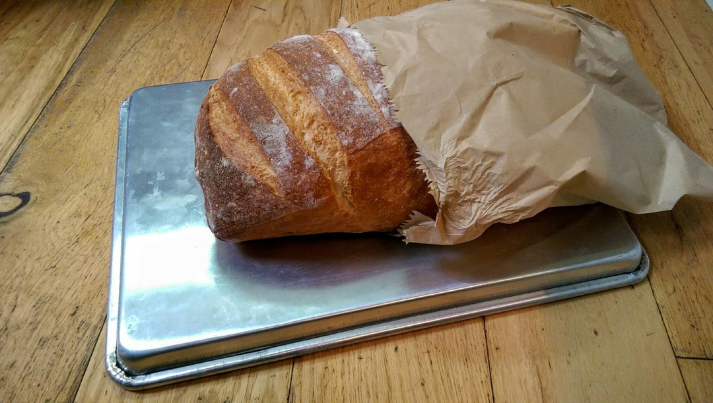
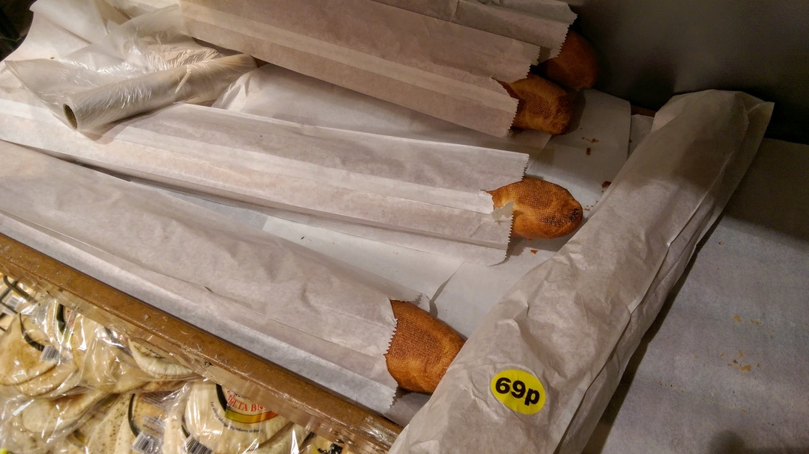
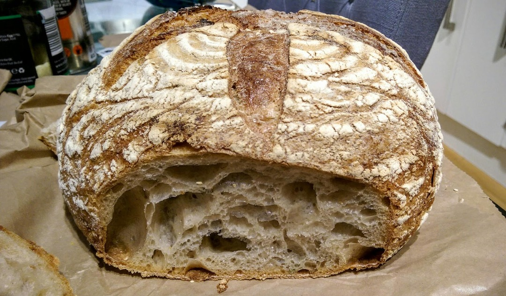
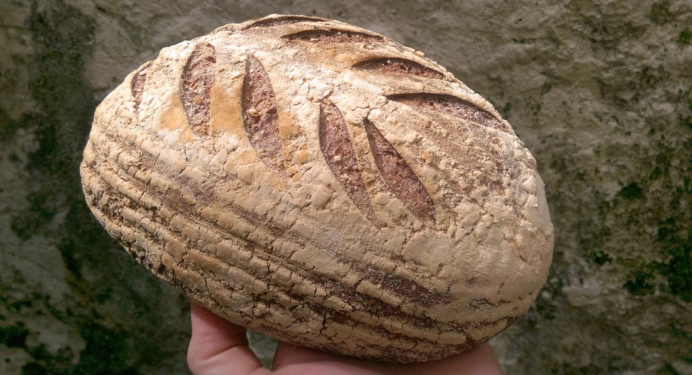

[< Back](readme.md)

# Bread
Shop bought bread can really only come from a proper baker. In this case it's
chewy white from Real Pâtisserie. You can get Real Pâtisserie bread from Taj but
it mostly comes in perforated plastic bags. At a push you could buy buns from
Waitrose and put them in the plain paper bags from the mushroom section rather
than those with the plastic panel.

Apart from baguettes! You can also use the spare paper bags for other groceries rather
than the plastic ones.

Cracking sea salt and rosemary sourdough from hisBe. Wow! 

Deft lame work from Silo.

[< Back](readme.md)
