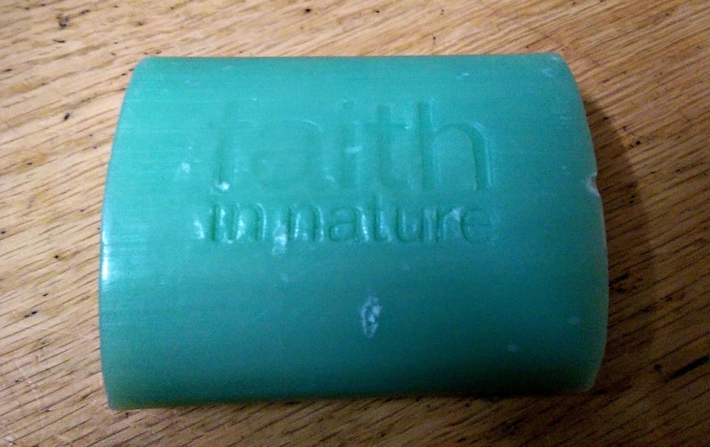
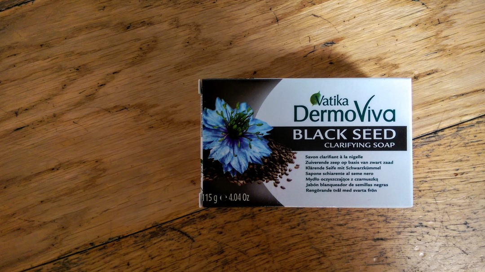
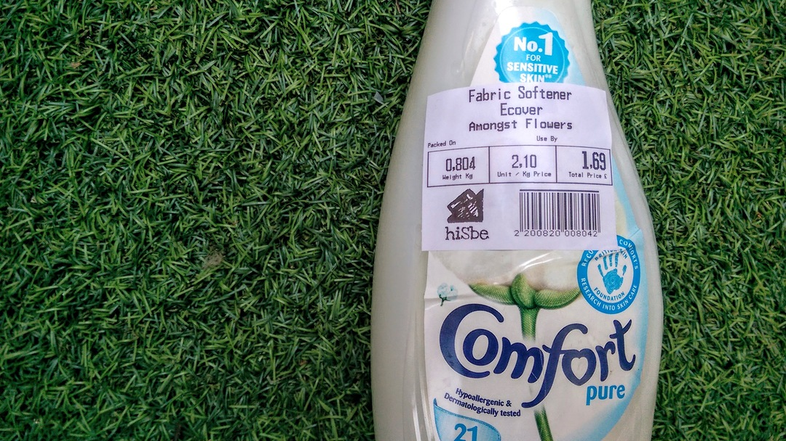
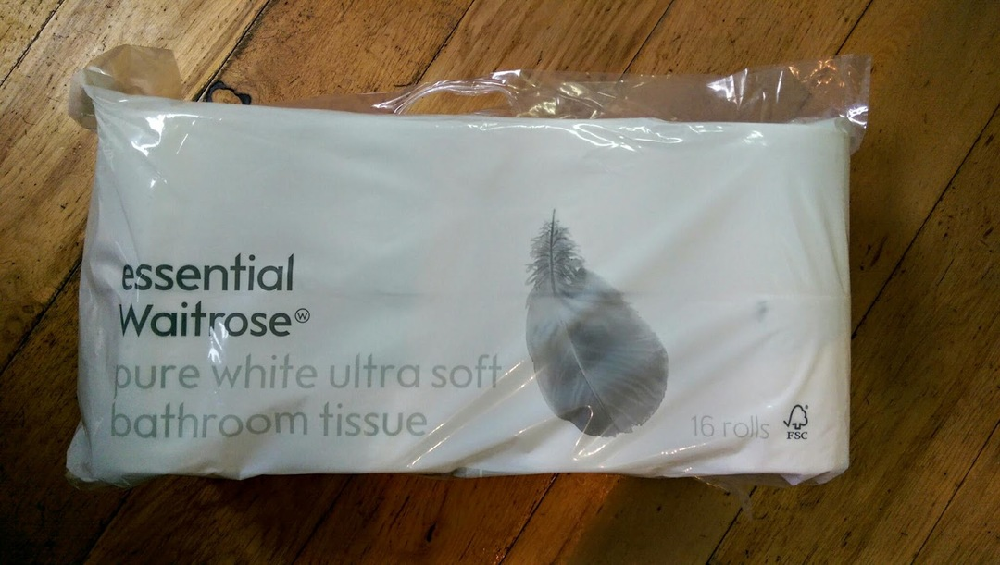
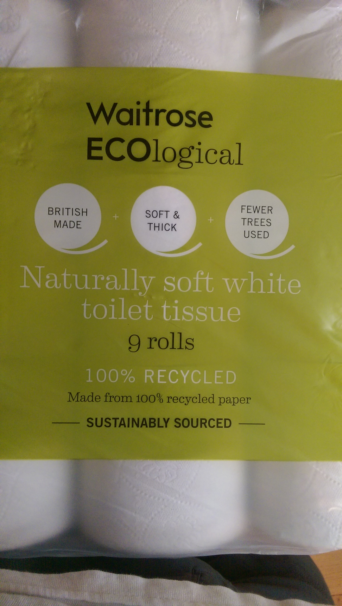

[< Top](readme.md)

# Cleaning products
Lots of options for buying soap without packaging but this is by Faith In
Nature and smells of rosemary. Bought from hisBe.

And a Vatika bar from Taj wrapped only in cardboard.

Loose fabric conditioner from hisBe:

# Toilet roll
Paper from FSC approved sources, plastic in the Waitrose carrier bag recycling.

And more recently, toilet roll made from recycled paper.

[< Top](readme.md)
