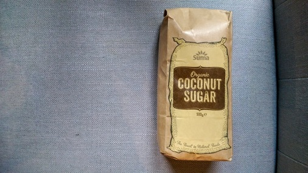
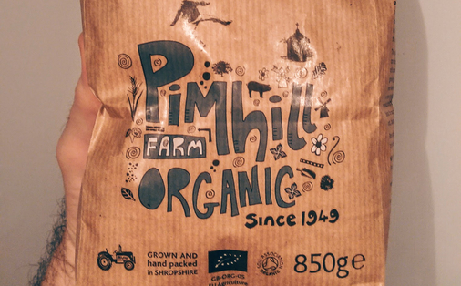

# Sugar
I used to use Billington's for bread making but why does it only come
wrapped in plastic? Old school Tate and Lyle it is. 

Paper packaging, made in Britain: cannot argue with that.

Or just for kicks why not try coconut sugar?

# Salt
hisBe have pulled out the stops and are now enabling us to buy salt without also buying bits of plastic to pour it with.

Alternatively, Tidman's might just save the day.

http://www.maldonsalt.co.uk/Products-Tidmans-Salt.html

# Vegetable bouillon
Not something I'd even considered buying loose. hisBe are great.

# Honey

Spoilt for choice with honey. This was excellent from Surrey. So good I ate it
before I managed to take a photo.

A great selection of Payne's honey from Taj.

# Oats
The first oats I found that didn't come in a plastic bag or a box with a plastic
panel. They even suggest you compost the packet. Love Pimhill Farm!

Loose oats from hisBe are very reasonably priced and you can take your own
vessel.

I'm very fond of Wessex Mill's bread flour and just spotted their oats in Taj.

And a couple from Waitrose in paper packaging. However, if we're going to be
fussy&mdash;and we shall&mdash;they both feature an unnecessary plastic tab on the top.

[< Back](readme.md)
