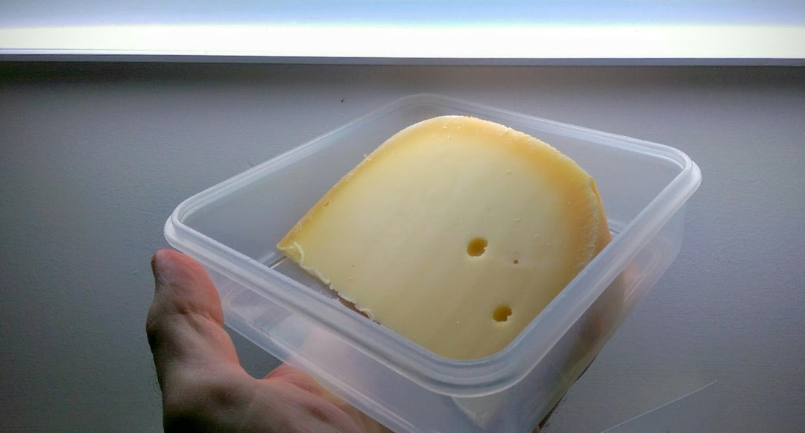
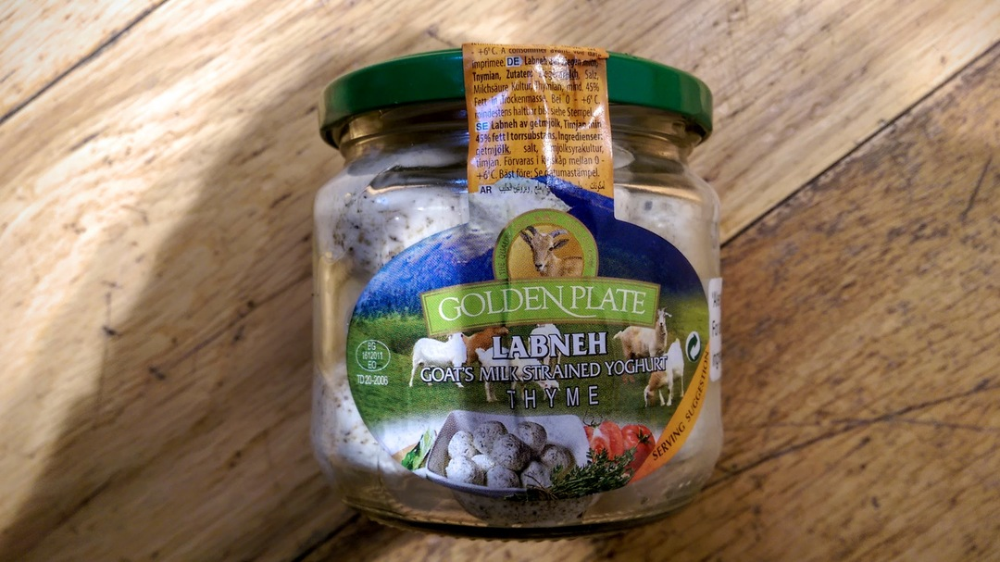

[< Top](readme.md)

# Cheese
Where can you buy cheese without any packaging? Tricky. La Cave à Fromage in
Hove is the answer. They're very accommodating and let me use my own box: zero
packaging with my delicious [Mayfield
Swiss](https://www.cookipedia.co.uk/recipes_wiki/Mayfield_Swiss_cheese), a
vegetarian mountain cheese made in Sussex. 

And here's some Labneh (yoghurt) in a jar from Taj. It pretty much tastes like
the beautiful goat cheese figuettes but at a fraction of the price. 

[< Top](readme.md)
