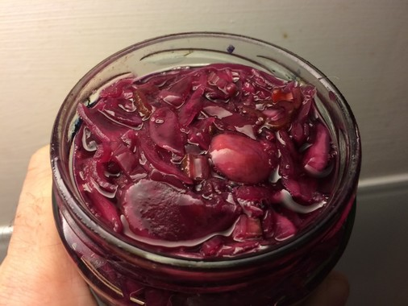

[< Top](readme.md)

# Basic principles of fermented cabbage

There's plenty of shop-bought kimchi in Brighton but very few in eco-friendly
packaging. So why not make your own?

- 100% red cabbage (loose, Infinity Foods)
- 25% wild garlic (wild, The Downs)
- 1.6% salt
- 1% red chilli (loose, Taj)

Chop everything and mix in the salt. Crush with your hands to get the juices
flowing (if it's a particularly tough cabbage you might need to use a pestle).
Leave for ten minutes and repeat until there's a good amount of liquid in the
bottom of the bowl.

Pack into a glass jar, leaving about 20% expansion space and close. This jar has
a nice silicone lid to let the gas out.

Keep out of the sunlight, it should start to bubble by day two. Taste it after a
week. Is it delicious? If so, eat on homemade bread with aioli. 

The flavour profile evolves over the course of a few weeks. If you manage to not
eat it all you'll notice the taste drops off after a few weeks. If you really
like the taste on a certain day move it to the fridge to slow it down.

# Fermented salsa

- 2 large tomatoes
- 1 long shallot
- 1/2 red chilli
- 2% salt (by weight)

Chop the tomatoes coarsely, everything else fine. Add the salt and crush the
mixture with your hands. Add to a jar making sure everything is submerged. Leave
for five days or so until it is zingy.

# Okraut

A experiment to see how okra behaves. The addition of okra makes it quite slippery! So possibly not for everybody. But
still.

# Beer and wine
[Bison Brewery](http://bisonbeer.co.uk/) sell large refillable bottles of
beer--affectionately known as "growlers"--from their shop on East Street. If
purchasing beer from a supermarket then don't choose those with six-pack rings.
Ten packs come in a cardboard box with no plastic. Or go to the pub. Or brew
your own!

# Bottle cleaning
Use an abrasive like old rice and a few drops of washing up liquid.

See mowerdog's [https://www.youtube.com/watch?v=HzPQDWTMAVQ](video).

[< Top](readme.md)
