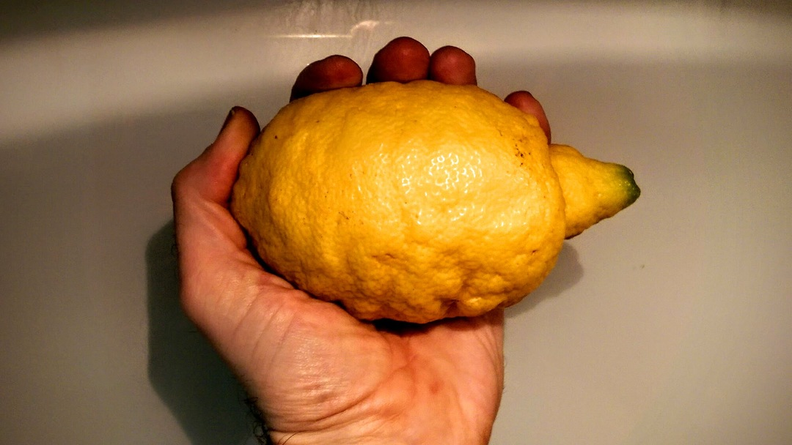
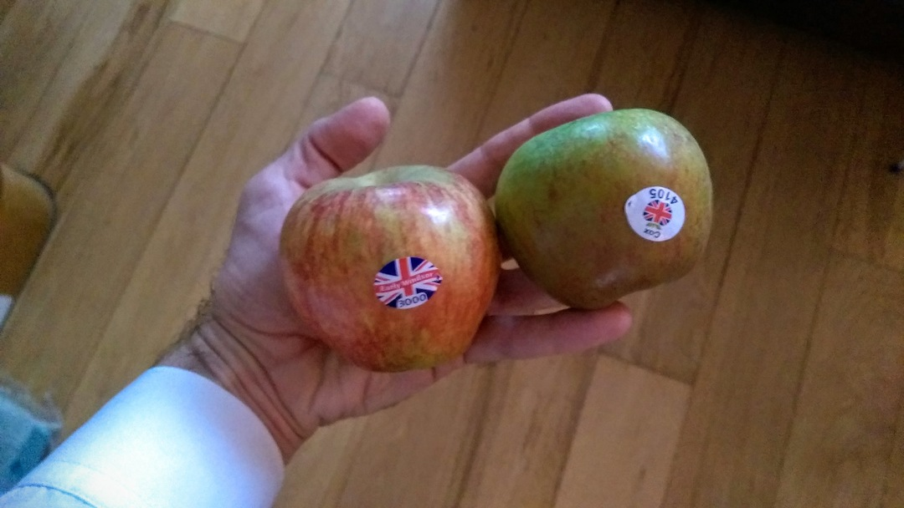
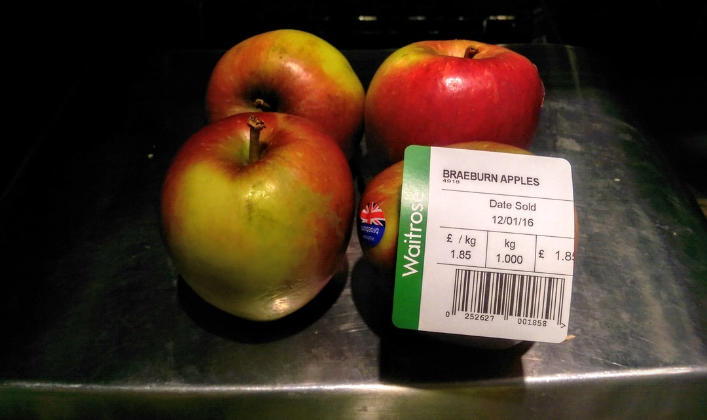
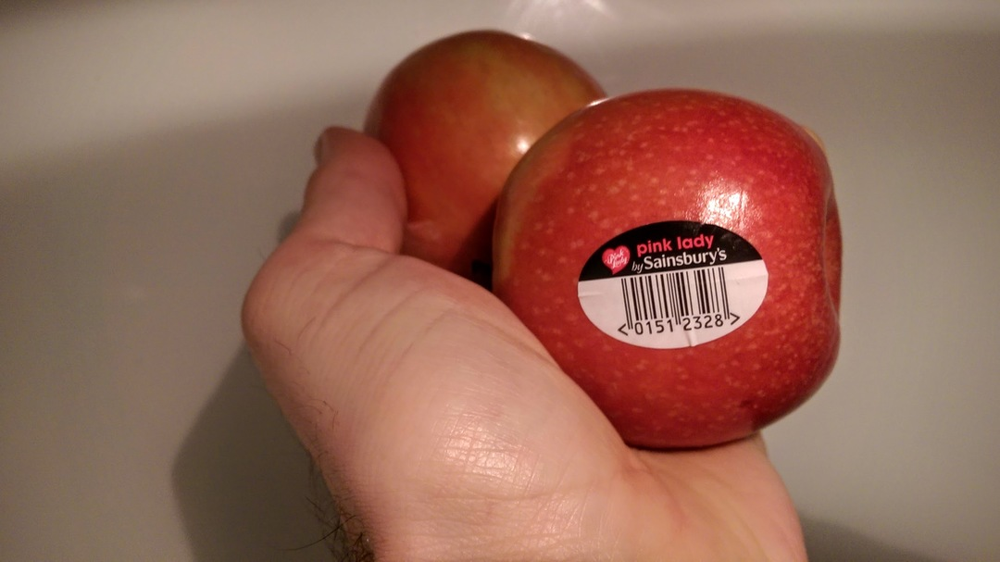
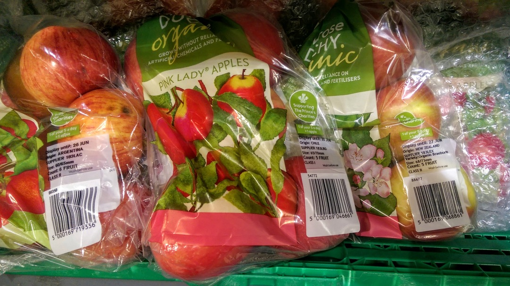
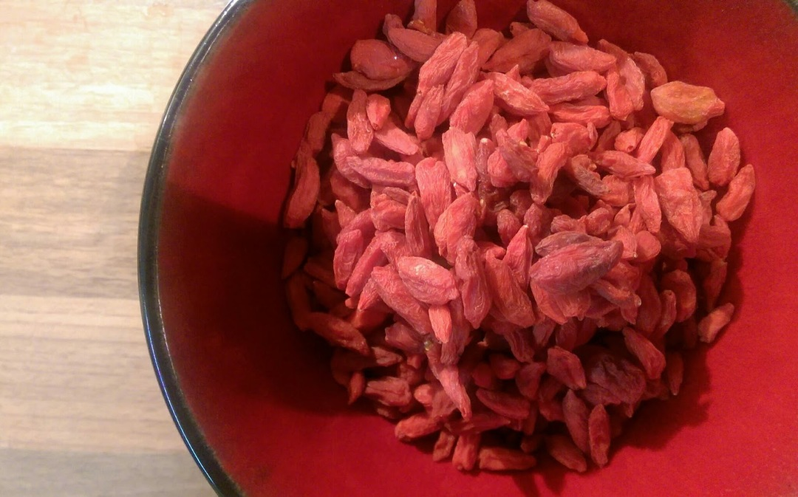

[< Back](readme.md)

# Fresh fruit
Why would you buy a net of tiny lemons from a supermarket when you could have
these beauties?

And finally some loose British apples from Taj!

Loose apples from Waitrose.

And loose French Pink Ladies from Sainsbury's Local. Expensive at £4+ per
kilo but still.

By contrast, organic apples from Waitrose. Each sealed in plastic and with a
choice of carbon footprint: Argentina, Chile or New Zealand.

# Dried fruit
Dried goji berries from hisBe.

Loose apricots from Taj.

