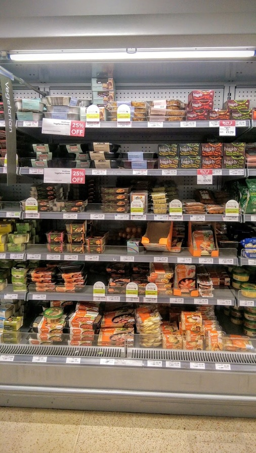
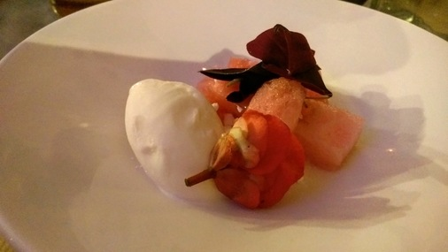

# Ready meals
The veggie ready meal section in Waitrose. Without exception each has a plastic tray or panel.

Interestingly the frozen section has plenty of choice in simply packaged
products.

# Newspapers
In the week newspapers are generally OK but at the weekend the food/environment pullouts must come in a plastic bag for convenience.

# Precious Plastic
Small scale plastic processing kits. The future!

http://preciousplastic.com/

# Water
We're fortunate enough to have a good supply in Brighton so it's difficult to
justify bottled water. But it is of course treated. If you're concerned about
chlorination for general consumption or home baking then it can be left to stand
or boiled.

Infinity Foods stock _Life_ refillable bottles if you'd rather have mineral
water: "which is sourced from springs on certified organic land in
Pembrokeshire."

For some bottle facts see [Ban the
Bottle](https://www.banthebottle.net/bottled-water-facts/). And see how
[Southern Water](https://www.southernwater.co.uk/water-treatment) treat what
comes out of our taps.

# I remember when everything around here was sealed in small claustrophobic boxes
Before long all you see is plastic. Equal-portioned high-carbon footprint
produce condemned to a petrochemical tomb. As nature intended.

# Trash is for tossers
Great dinner and chat with zero waste luminaries Douglas McMaster (Silo
Brighton), Tom Griffiths (Flank) and Lauren Singer.

- http://www.trashisfortossers.com/
- http://www.silobrighton.com/
- http://www.flankbrighton.com/

# ASUS laptop
New laptop. That's _so_ close to using only recyclable packaging. Come on, guys!

[< Back](readme.md)
