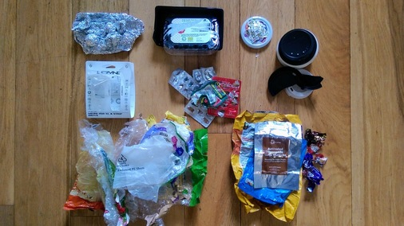

# Mid-year review

What's the best way to assess your plastic usage? Keep all of it.

Pledge to keep everything that is neither biodegradable nor recyclable in your
area or office. A nice idea is to fill a jar and see how long it takes to fill
it. It makes it all the more horrifying when you have to thrown it away in bulk,
knowing that it's destined for the landfill.

It also makes you consider how much you want that bag of crisps knowing that the
bag will be hanging around for decades. Conveniently, processed food usually
comes in plastic so it makes it quite easy to avoid.

## 2017

Packaging from the following:
- Karg's crackers
- Roasted fava beans
- Cracker box
- Crisps
- Blister pack
- Apple stickers
- Coffee lids
- Quorn sausage roll
- Chocolate bar foil

## 2016

Clockwise from top left:
- Tin foil from chocolate bars and breakfast roll
- Fruit trays
- Apple stickers
- Coffee lids
- Bike light/shirt packaging
- Vitamins and medicine In blister packs
- Assorted plastic bags (mostly fruit and bread)
- Foil wrappers from crisps, seeds and chocolate

