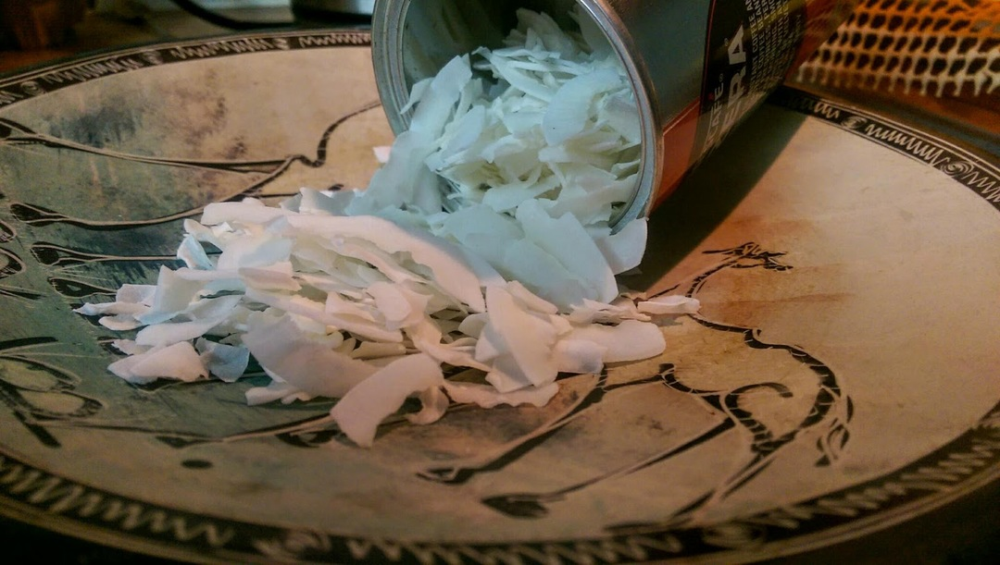
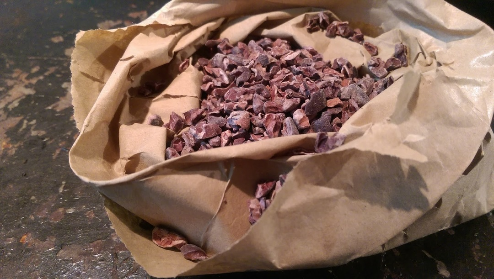
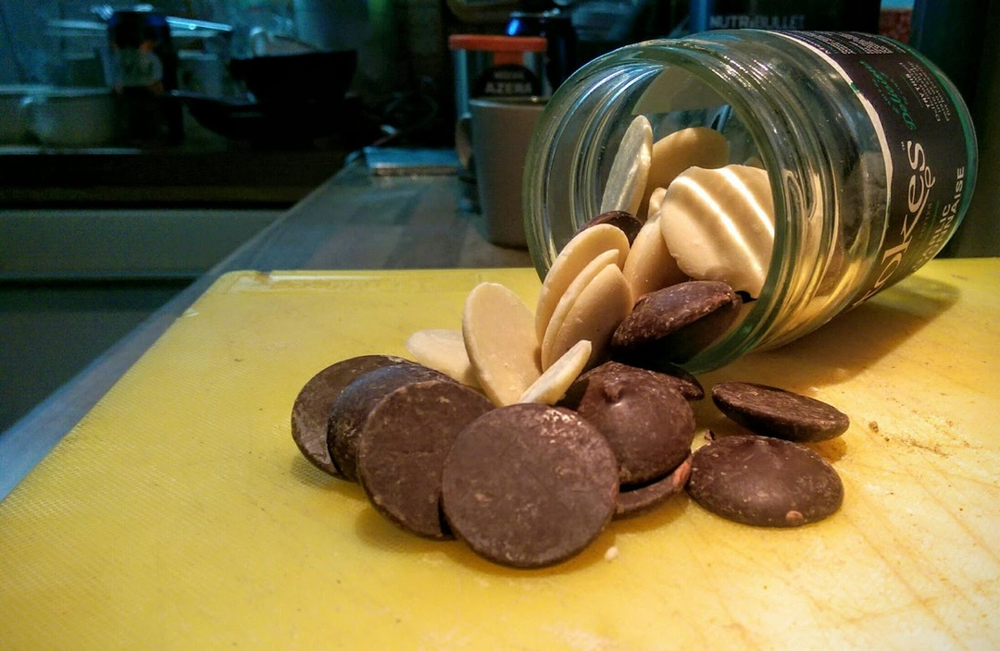
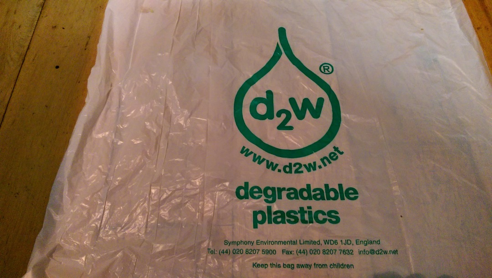
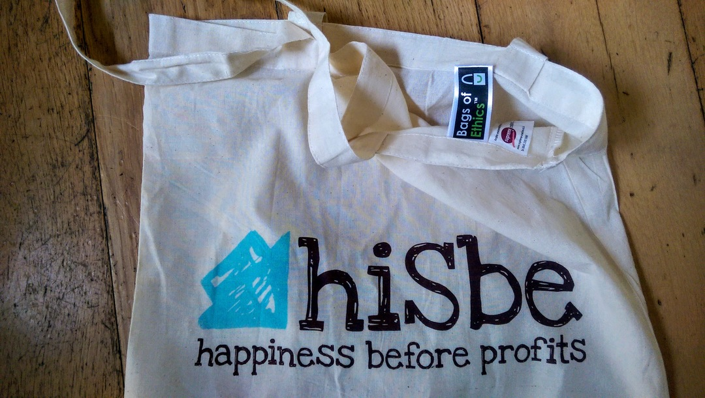
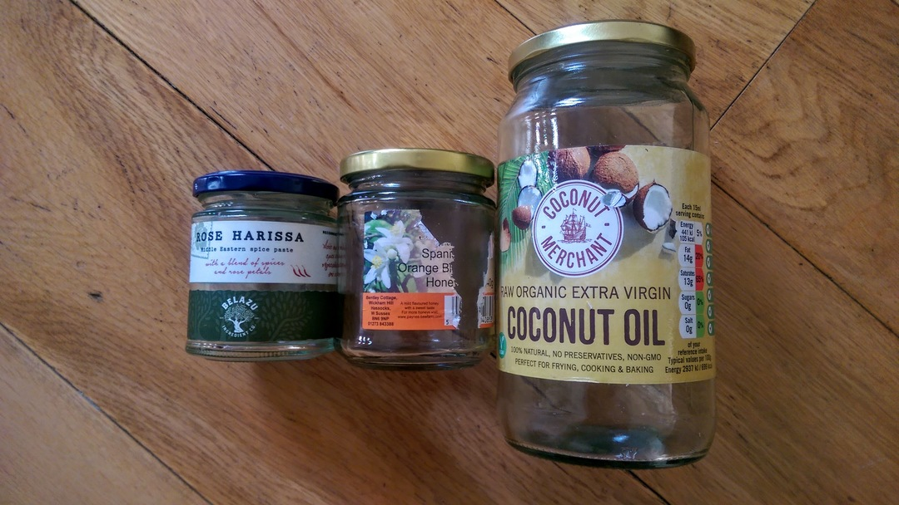
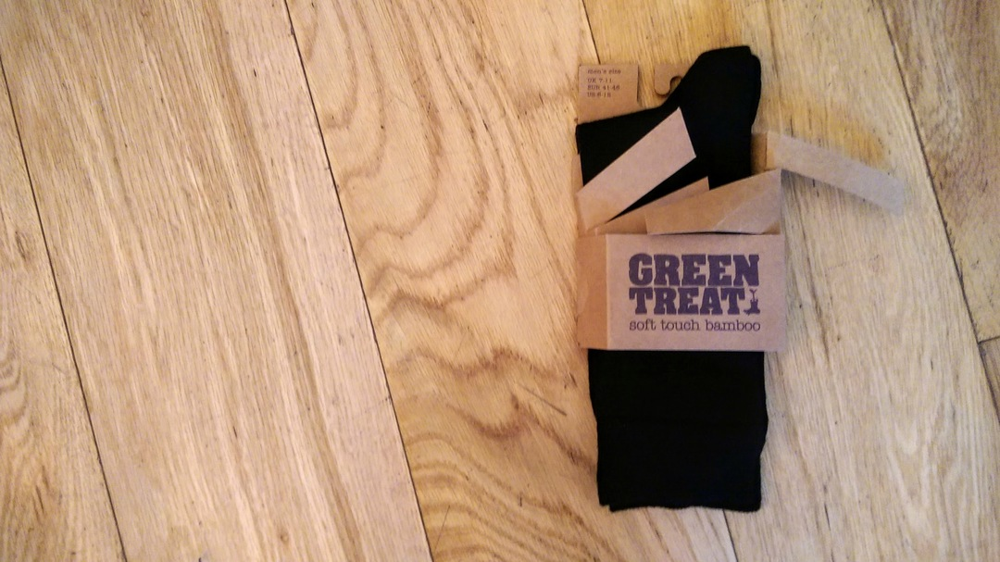

- [fermentation](fermentation.md)
- [sport](sport.md)
- [welfare](welfare.md)
- [recycling](recycling.md)
- [cooking](cooking.md)
- [baking](baking.md)

# End of year review of my work zero waste pot
Pledge to keep everything that doesn't biodegrade nor is recyclable in your
area or office. This is my last nine month's worth.

The jar emptied out, clockwised from top left:

- Tin foil from chocolate bars and breakfast roll
- Fruit trays
- Apple stickers
- Coffee lids
- Bike light/shirt packaging
- Vitamins and medicine In blister packs
- Assorted plastic bags (mostly fruit and bread)
- Foil wrappers from crisps, seeds and chocolate
- Most things I keep in a jar.

# Ready meals
The veggie ready meal section in Waitrose. Without exception each has a plastic tray or panel.

Interestingly the frozen section has plenty of choice in simply packaged
products.

# Fruit

Why would you buy a net of tiny lemons from a supermarket when you could have
these beauties?

And finally some loose British apples from Taj!

Loose apples from Waitrose.

And loose French Pink Ladies from Sainsbury's Local. Expensive at £4+ per
kilo but still.

By contrast, organic apples from Waitrose. Each sealed in plastic and with a
choice of carbon footprint: Argentina, Chile or New Zealand.

# Oats
The first oats I found that didn't come in a plastic bag or a box with a plastic
panel. They even suggest you compost the packet. Love Pimhill Farm!

Loose oats from hisBe are very reasonably priced and you can take your own
vessel.

I'm very fond of Wessex Mill's bread flour and just spotted their oats in Taj.

And a couple from Waitrose in paper packaging. However, if we're going to be
fussy&mdash;and we shall&mdash;they both feature an unnecessary plastic tab on the top.

# Toilet roll
Paper from FSC approved sources, plastic in the Waitrose carrier bag recycling.

And more recently, toilet roll made from recycled paper.

# Cheese
Where can you buy cheese without any packaging? Tricky. La Cave à Fromage in
Hove is the answer. They're very accommodating and let me use my own box: zero
packaging with my delicious [Mayfield
Swiss](https://www.cookipedia.co.uk/recipes_wiki/Mayfield_Swiss_cheese), a
vegetarian mountain cheese made in Sussex. 

And here's some Labneh (yoghurt) in a jar from Taj. It pretty much tastes like
the beautiful goat cheese figuettes but at a fraction of the price. 

# Sandwich greens
All major supermarkets pack their greens in plastic so they're out. However, Taj
do bundles of spinach with no packaging; we just need to juice the stems, compost the
roots and put the rubber bands to good use.

Proper spring onions from Taj!

# hiSbe Food CIC
I must confess I've only recently started visiting [hisBe](http://hisbe.co.uk/)
regularly: when the zero-waste ideal really clicked in my brain. I tend to write
articles about products but hisBe have so many things that only _they_ do that
it makes more sense to list them on one page.

__Deydrated coconut__

__Cacao nibs__

__Chocolate__

Loose plain, milk and white chocolate buttons. They're only £10/Kg too, whereas
Waitrose is at £15-20/Kg for a 100g bar of Green and Blacks. And you have to do
something with the packaging.

# Newspapers
In the week newspapers are generally OK but at the weekend the food/environment pullouts must come in a plastic bag for convenience.

# Plastic bags

It goes without saying: no plastic bags. Ever! People argue that they reuse
them, but how many times must they be reused to justify the decades they will be
hanging around afterwards? Must they be handed down to their children to offset
the manufacturing cost and environmental impact? Even official bags-for-life are
unlikely to last for the duration of your lifetime as claimed. But a cotton bag
will at least have a chance of decomposition when it has reached the end of its
useful life.

The answer can only be to not use plastic bags at all. See [this
article](http://www.wsj.com/articles/SB122238422541876879) in the Wall Street
Journal.

Various Twitter chat about plastic bags:

__Waitrose__

Dean Turbo @deanturbo  Jan 3 2016:

"@waitrose hi! Can beercan plastic rings go in with the plastic bag recycling?
And are they sorted manually when they leave the store?"

Waitrose @waitrose  Jan 3 2016:

"@deanturbo I'm afraid not - only plastic bags and film displaying the OPRL logo
can be recycled"

On-Pack Recycling Label: http://www.oprl.org.uk/

__Sainsbury's__

Dean Turbo @deanturbo  Jan 12 2016:

"@sainsburys Hi! Just noticed the 5p bags don't have the OPRL logo on them. Does
this mean they can't be recycled in store?"

Sainsbury's @sainsburys  Jan 12 2016:

"@deanturbo Hi Dean, they're made of recycled material and are recyclable, we'll
replace them free of charge if they become damaged." 

And here are some biodegradable bin bags from Infinity Foods. See
[d2w](http://d2w.net).

# Tea, please...
A goodly selection of loose tea and tea-supping accoutrements from Bluebird Tea Co. and 10% discount for bringing your own pot.

Heath and Heather offer tea without the unnecessary paper pouches.

Failing that, Pukka do tea in wholly recyclable paper packaging.

As do Yogi. But be careful as I have seen some in plastic wrap!

As an aside: all three look like they're tied shut. But the Heath and Heather
also appear to be thermally sealed suggesting a small quantity of plastic in the
paper mix.

# Beer and wine
[Bison Brewery](http://bisonbeer.co.uk/) sell large refillable bottles of
beer--affectionately known as "growlers"--from their shop on East Street. If
purchasing beer from a supermarket then don't choose those with six-pack rings.
Ten packs come in a cardboard box with no plastic. Or go to the pub. Or brew
your own!

# Precious Plastic
Small scale plastic processing kits. The future!

http://preciousplastic.com/

# Cleaning products
Lots of options for buying soap without packaging but this is by Faith In
Nature and smells of rosemary. Bought from hisBe.

And a Vatika bar from Taj wrapped only in cardboard.

Loose fabric conditioner from hisBe:

# Refuse collection
It's easy to forget how convenient it is for somebody else to sort your rubbish
out for you. Brighton during the bin strike, June 2013. 

# Honey

Spoilt for choice with honey. This was excellent from Surrey. So good I ate it
before I managed to take a photo.

A great selection of Payne's honey from Taj.

# Water
We're fortunate enough to have a good supply in Brighton so it's difficult to
justify bottled water. But it is of course treated. If you're concerned about
chlorination for general consumption or home baking then it can be left to stand
or boiled.

Infinity Foods stock _Life_ refillable bottles if you'd rather have mineral
water: "which is sourced from springs on certified organic land in
Pembrokeshire."

For some bottle facts see [Ban the
Bottle](https://www.banthebottle.net/bottled-water-facts/). And see how
[Southern Water](https://www.southernwater.co.uk/water-treatment) treat what
comes out of our taps.

# Spectacular low-impact cheese sandwich

- Bread, Silo
- Smoked cheddar, La Cave à Fromage
- Spinach, Taj
- Tomatoes, The Open Market
- Harissa and mayonnaise in glass jars (no plastic seal), Waitrose

## Waste
- Two paper bags to recycle/reuse 
- Two rubber bands to repurpose
- Stalks in the Nutribullet
- Roots and vines in the compost

# Glass jars
Love a nice glass jar. And if you end up with too many somewhere like
[Silo](http://www.silobrighton.com) or [Flank](http://www.flankbrighton.com/)
will probably take them off your hands. Make sure to avoid those with plastic
seals. 

# I remember when everything around here was sealed in small claustrophobic boxes
Before long all you see is plastic. Equal-portioned high-carbon footprint
produce condemned to a petrochemical tomb. As nature intended.

# Dried fruit
Dried goji berries from hisBe.

Loose apricots from Taj.

# Trash is for tossers
Great dinner and chat with zero waste luminaries Douglas McMaster (Silo
Brighton), Tom Griffiths (Flank) and Lauren Singer.

- http://www.trashisfortossers.com/
- http://www.silobrighton.com/
- http://www.flankbrighton.com/

# Loose peppers
In Waitrose you can buy two loose peppers. Or two peppers in a plastic bag. 

# Lemongrass
Nice bit of lemongrass from Taj.

You can repurpose the bands or make an awesome rubber band ball!

# ASUS laptop
New laptop. That's _so_ close to using only recyclable packaging. Come on, guys!

# Salt
hisBe have pulled out the stops and are now enabling us to buy salt without also buying bits of plastic to pour it with.

Alternatively, Tidman's might just save the day.

http://www.maldonsalt.co.uk/Products-Tidmans-Salt.html

# Vegetable bouillon
Not something I'd even considered buying loose. hisBe are great.

# Socks
I didn't think I would be posting about socks when I started this but hey!
Interesting material and minimal packaged. In fact the only thing that wasn't
recyclable was the security tag on the back.

# Mye Mye
New pan-Asian restaurant Mye Mye. If you pick carefully you can walk out with
all biodegradable packaging. And it's tasty!

# Sugar
I used to use Billington's for bread making but why does it only come
wrapped in plastic? Old school Tate and Lyle it is. 

Paper packaging, made in Britain: cannot argue with that.

Or just for kicks why not try coconut sugar?

