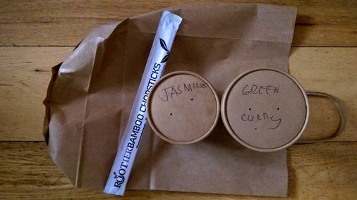

- [Fermentation](fermentation.md)
- [Sport](sport.md)
- [Welfare](welfare.md)
- [Recycling](recycling.md)
- [Recipes](recipes.md)
- [Baking](baking.md)
- [Fruit](fruit.md)
- [Cleaning](cleaning.md)
- [Shops](shops.md)
- [Dairy](dairy.md)
- [Veg](veg.md)

# End of year review of my work zero waste pot
Pledge to keep everything that doesn't biodegrade nor is recyclable in your
area or office. This is my last nine month's worth.

The jar emptied out, clockwised from top left:

- Tin foil from chocolate bars and breakfast roll
- Fruit trays
- Apple stickers
- Coffee lids
- Bike light/shirt packaging
- Vitamins and medicine In blister packs
- Assorted plastic bags (mostly fruit and bread)
- Foil wrappers from crisps, seeds and chocolate
- Most things I keep in a jar.

# Ready meals
The veggie ready meal section in Waitrose. Without exception each has a plastic tray or panel.

Interestingly the frozen section has plenty of choice in simply packaged
products.

# Oats
The first oats I found that didn't come in a plastic bag or a box with a plastic
panel. They even suggest you compost the packet. Love Pimhill Farm!

Loose oats from hisBe are very reasonably priced and you can take your own
vessel.

I'm very fond of Wessex Mill's bread flour and just spotted their oats in Taj.

And a couple from Waitrose in paper packaging. However, if we're going to be
fussy&mdash;and we shall&mdash;they both feature an unnecessary plastic tab on the top.

# Newspapers
In the week newspapers are generally OK but at the weekend the food/environment pullouts must come in a plastic bag for convenience.

# Tea, please...
A goodly selection of loose tea and tea-supping accoutrements from Bluebird Tea Co. and 10% discount for bringing your own pot.

Heath and Heather offer tea without the unnecessary paper pouches.

Failing that, Pukka do tea in wholly recyclable paper packaging.

As do Yogi. But be careful as I have seen some in plastic wrap!

As an aside: all three look like they're tied shut. But the Heath and Heather
also appear to be thermally sealed suggesting a small quantity of plastic in the
paper mix.

# Precious Plastic
Small scale plastic processing kits. The future!

http://preciousplastic.com/

# Honey

Spoilt for choice with honey. This was excellent from Surrey. So good I ate it
before I managed to take a photo.

A great selection of Payne's honey from Taj.

# Water
We're fortunate enough to have a good supply in Brighton so it's difficult to
justify bottled water. But it is of course treated. If you're concerned about
chlorination for general consumption or home baking then it can be left to stand
or boiled.

Infinity Foods stock _Life_ refillable bottles if you'd rather have mineral
water: "which is sourced from springs on certified organic land in
Pembrokeshire."

For some bottle facts see [Ban the
Bottle](https://www.banthebottle.net/bottled-water-facts/). And see how
[Southern Water](https://www.southernwater.co.uk/water-treatment) treat what
comes out of our taps.

# I remember when everything around here was sealed in small claustrophobic boxes
Before long all you see is plastic. Equal-portioned high-carbon footprint
produce condemned to a petrochemical tomb. As nature intended.

# Trash is for tossers
Great dinner and chat with zero waste luminaries Douglas McMaster (Silo
Brighton), Tom Griffiths (Flank) and Lauren Singer.

- http://www.trashisfortossers.com/
- http://www.silobrighton.com/
- http://www.flankbrighton.com/

# ASUS laptop
New laptop. That's _so_ close to using only recyclable packaging. Come on, guys!

# Salt
hisBe have pulled out the stops and are now enabling us to buy salt without also buying bits of plastic to pour it with.

Alternatively, Tidman's might just save the day.

http://www.maldonsalt.co.uk/Products-Tidmans-Salt.html

# Vegetable bouillon
Not something I'd even considered buying loose. hisBe are great.

# Mye Mye
New pan-Asian restaurant Mye Mye. If you pick carefully you can walk out with
all biodegradable packaging. And it's tasty!

# Sugar
I used to use Billington's for bread making but why does it only come
wrapped in plastic? Old school Tate and Lyle it is. 

Paper packaging, made in Britain: cannot argue with that.

Or just for kicks why not try coconut sugar?

