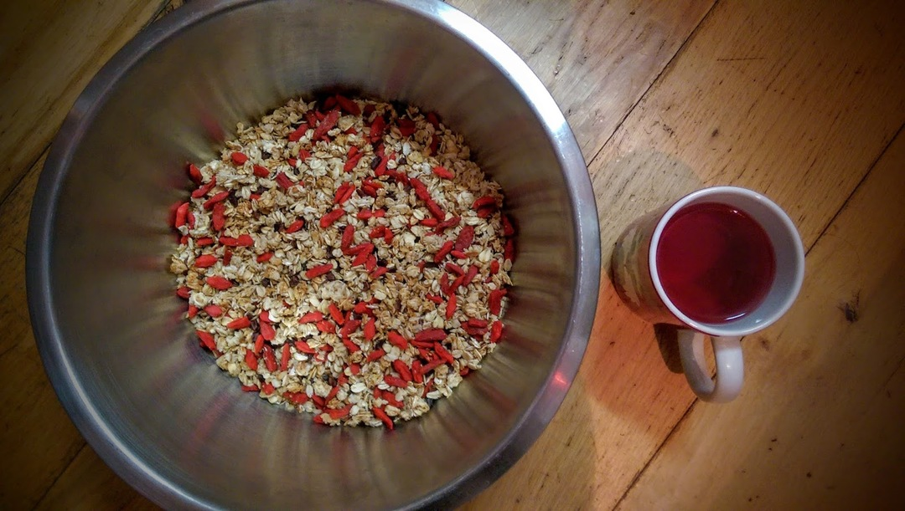
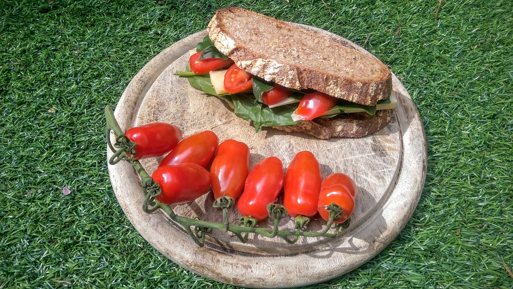
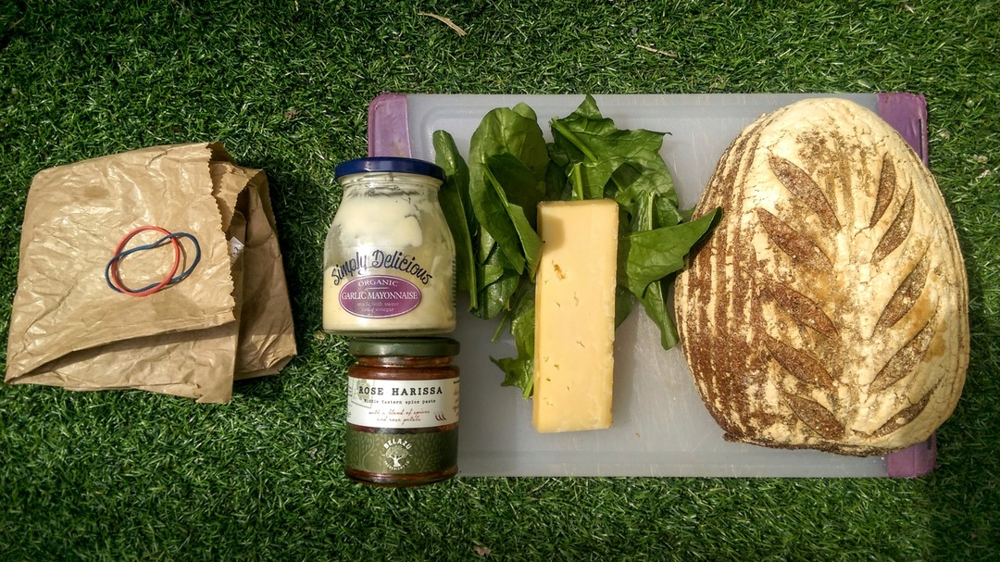
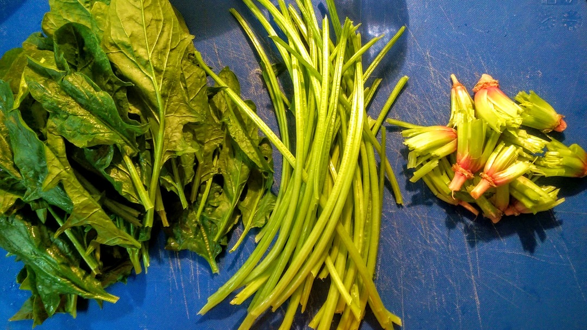

[< Back](readme.md)

# Granola
I've been thinking about this granola for a while and finally found some dried
fruit that doesn't come in a plastic bag. It's basically 300g of oats and then
60g of anything else you have to hand.

__From hiSbe Food CIC (loose):__

- 300g large oats
- 60g cacao nibs
- 60g dried goji berries

__From Waitrose:__

- 60g Silverspoon UK-grown caster sugar (paper bag)

__From Adam the apiarist - Surrey Honey (glass jar):__

- 60g Surrey honey

__From Taj (glass jar)__

- 60g Coconut oil

Combine everything bar the berries (lest they burn), spread on a tray and cook
at 200C for 8 minutes until brown (give it a stir around halfway through). I
tend to chuck the berries on top when it comes out of the oven.

Actually you can chuck just about anything in and 60g seems a good proportion. I
try not to make it too much about seeds but hemp and flax make an interesting
addition. And if you're feeling flush you can omit the sugar and double up on
the honey. I have tried olive oil when I've run out of coconut but it seems to
catch (burn) very easily. Keep an eye on it.

Once you're happy with it check your Twitter for a while whilst it cools and
transfer to an airtight container. This does keep it nice and crisp but we're
all busy people and it will keep quite happily for a week covered with another
baking tray.

Starting with 300g of oats makes one baking tray's worth. I tend to do two at
once, the lower one stays in for the first eight minutes, stir and then I bring
it to the top for a further four minutes.

# Epic cheese sandwich

- Bread, Silo
- Smoked cheddar, La Cave à Fromage
- Spinach, Taj
- Tomatoes, The Open Market
- Harissa and mayonnaise in glass jars (no plastic seal), Waitrose

## Waste
- Two paper bags to recycle/reuse 
- Two rubber bands to repurpose
- Stalks in the Nutribullet
- Roots and vines in the compost

[< Back](readme.md)
