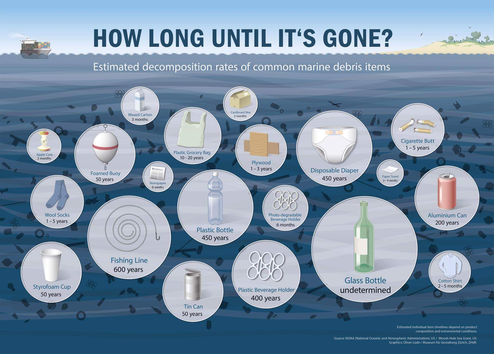

[< Top](readme.md)

# Which types of plastic can be recycled?
From [Brighton and Hove recycling
FAQ](http://www.brighton-hove.gov.uk/content/environment/recycling-rubbish-and-street-cleaning/recycling-faqs)

## Bottle recycling in Brighton
Plastic bottles are the only plastics that Brighton & Hove and many other local
authorities currently recycle. Plastic bottles are mainly made from PET plastic
(soft drinks and water bottles) and HDPE (milk and detergent bottles). There are
already markets for plastic bottles as these can be recycled back into bottles
or even fleeces!

There are several reasons why other plastics are not currently being recycled.
These include:
- There are not well developed and secure markets for all plastics. This means
  we may not be able to sell them on.
- Even though some items such as food trays might be made from PET, they have
  different properties than the PET used to make bottles. This means we may not
  be able to process the material.
- Plastics are used to make food trays and there is a concern that residents
  might place trays out for recycling that still contain food. If too much
  recycling becomes contaminated, it cannot be processed.

## Lids
> Yes as the lids are made from different plastics so can contaminate the
> recycling. Please wash and squash your plastic bottles and put them in your
> recycling box without lids. 

And come contradictory advice from Twitter:

> BHCC_Cityclean (@RecyclingRefuse) Jan 7 2016, on communal recycling bins:
>  If you're removing plastic lids from glass bottles, just unscrew the top and
>  leave the ring attached to the bottle. You can cut them off if you really
>  want to remove them. Plastic bottles can have them left on. Ryan.

# Soya milk and Tetra Pack recycling
Couldn't find the Tetra Pack recycling point on the [council website](http://www.brighton-hove.gov.uk/content/recycling-bins-map) but it's [here](https://www.google.co.uk/maps/@50.8285584,-0.1377455,3a,15y,296.01h,78.37t/data=!3m6!1e1!3m4!1swEfHWdBDEH__9ClosMu0Vg!2e0!7i13312!8i6656?hl=en). Magpie might collect them too.

Alpro and granaVita have slightly fewer components: some of them have an extra plastic bung. 

And Bonsoy has no plastic bits... yey! (But it is twice the price.)

# Refuse collection
It's easy to forget how convenient it is for somebody else to sort your rubbish
out for you. Brighton during the bin strike, June 2013. 

# Plastic bags

It goes without saying: no plastic bags. Ever! People argue that they reuse
them, but how many times must they be reused to justify the decades they will be
hanging around afterwards? Must they be handed down to their children to offset
the manufacturing cost and environmental impact? Even official bags-for-life are
unlikely to last for the duration of your lifetime as claimed. But a cotton bag
will at least have a chance of decomposition when it has reached the end of its
useful life.

The answer can only be to not use plastic bags at all. See [this
article](http://www.wsj.com/articles/SB122238422541876879) in the Wall Street
Journal.

Various Twitter chat about plastic bags:

__Waitrose__

Dean Turbo @deanturbo  Jan 3 2016:

"@waitrose hi! Can beercan plastic rings go in with the plastic bag recycling?
And are they sorted manually when they leave the store?"

Waitrose @waitrose  Jan 3 2016:

"@deanturbo I'm afraid not - only plastic bags and film displaying the OPRL logo
can be recycled"

On-Pack Recycling Label: http://www.oprl.org.uk/

__Sainsbury's__

Dean Turbo @deanturbo  Jan 12 2016:

"@sainsburys Hi! Just noticed the 5p bags don't have the OPRL logo on them. Does
this mean they can't be recycled in store?"

Sainsbury's @sainsburys  Jan 12 2016:

"@deanturbo Hi Dean, they're made of recycled material and are recyclable, we'll
replace them free of charge if they become damaged." 

And here are some biodegradable bin bags from Infinity Foods. See
[d2w](http://d2w.net).

# How long until it's gone?

[< Top](readme.md)
