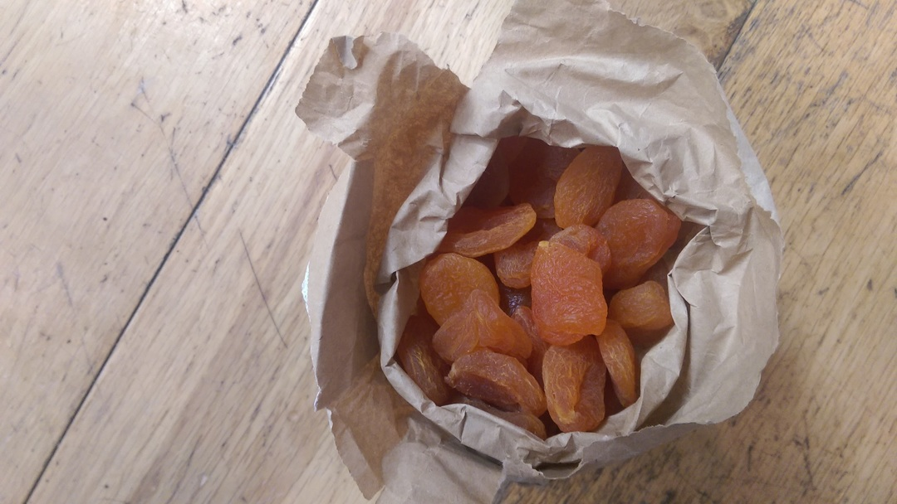

[< Back](readme.md)

# Energy gels
Gels are the scourge of the countryside. I find it baffling that people just
throw the clearly non-biodegradable foil away. Instead of these I fill my water
bottle with sugar and fruit tea (if I'm feeling that way). Not quite the hit of
a gel but can I really warrant such waste as a weekend athlete? I don't think
so.

# Bike clips
Old school "trouser bands" rather then the cooler snappy things that are made
from bits of plastic and self-destruct after a couple of months.

Edit: but they're not very good! Will try them again.

# Snacks
Pop some of these in your jersey. Loose apricots from Taj.

Note: paper bag is from hisBe, they only have plastic bags in Taj.

[< Back](readme.md)
