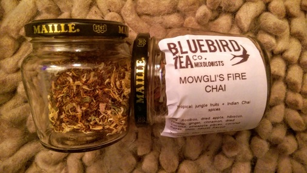

# Tea, please...
A goodly selection of loose tea and tea-supping accoutrements from Bluebird Tea Co. and 10% discount for bringing your own pot.

Heath and Heather offer tea without the unnecessary paper pouches.

Failing that, Pukka do tea in wholly recyclable paper packaging.

As do Yogi. But be careful as I have seen some in plastic wrap!

As an aside: all three look like they're tied shut. But the Heath and Heather
also appear to be thermally sealed suggesting a small quantity of plastic in the
paper mix.

[< Back](readme.md)
