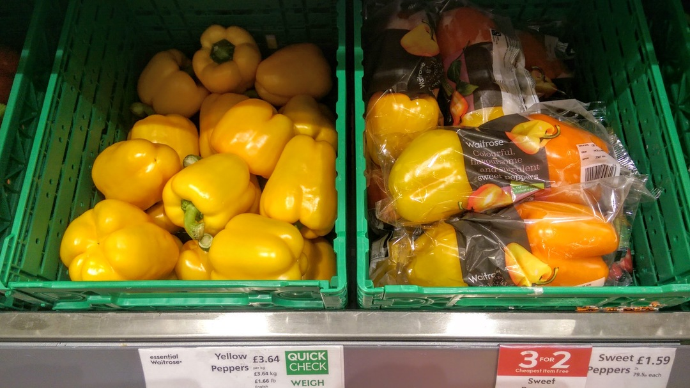
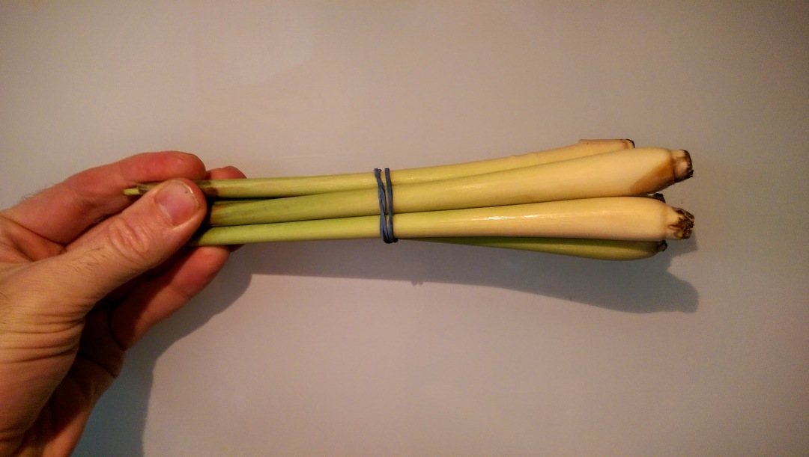
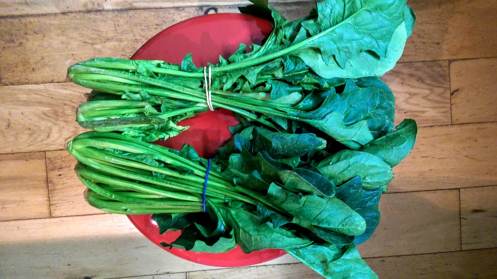
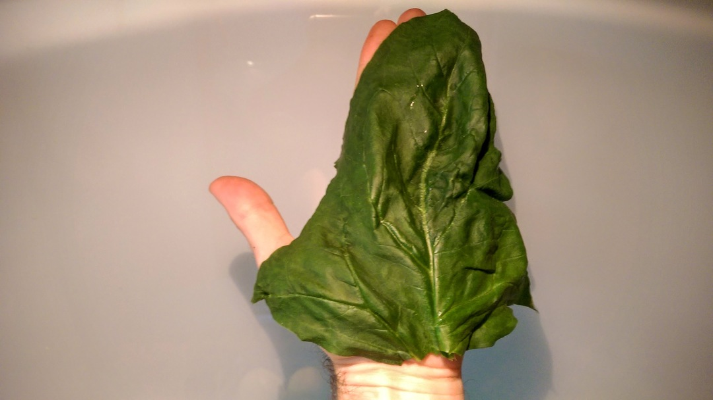

# Loose peppers
In Waitrose you can buy two loose peppers. Or two peppers in a plastic bag. 

# Lemongrass
A nice bit of lemongrass from Taj.

You can repurpose the bands or make an awesome rubber band ball!

# Sandwich greens
All major supermarkets pack their greens in plastic so they're out. However, Taj
do bundles of spinach with no packaging; we just need to juice the stems, compost the
roots and put the rubber bands to good use.

Proper spring onions from Taj!

